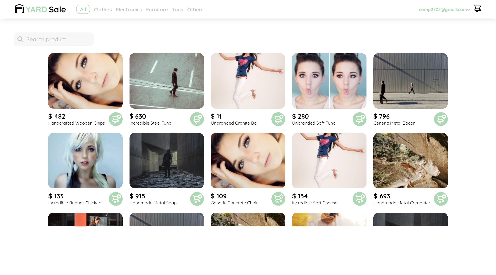
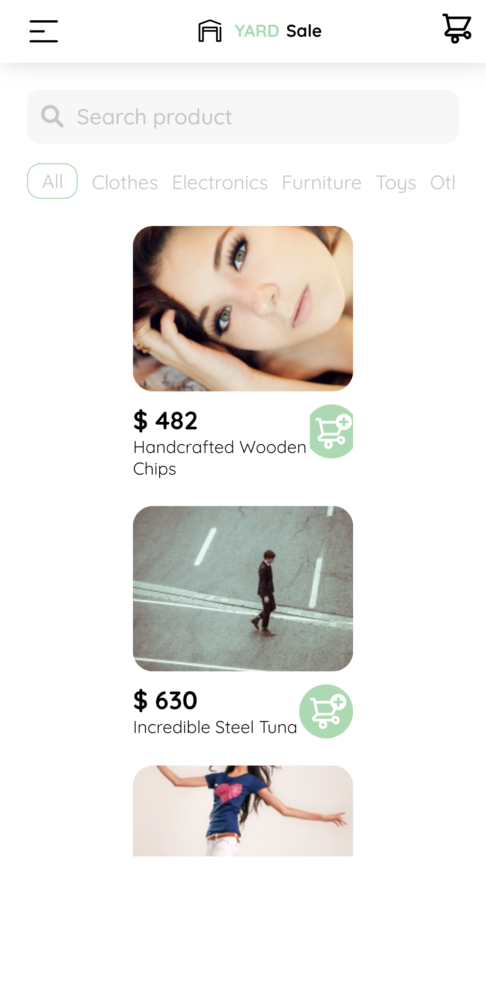

# Yard Sale

Development of a shopping cart using an external API for the list of products. Development from figma designs.

## Screenshots

## Table of Contents

- [Project](#evolution)
- [Run locally](#run-locally)
- [Deployment](#deployment)
- [Built with](#built-with)
- [Useful resources](#useful-resources)

## 💼 Evolution 

- functionally complete application
- optimizing part 1
- adding PWA

## 💻 Run locally 

### To run in development environment

    npm run dev

### To test PWA (build and preview)

    npm run build && npm run preview

## 🚀 Deployment 

- [Live Site URL](https://yard-sale-xsr.netlify.app/)

## 🛠 Built with 

- Semantic HTML5 markup
- CSS custom properties
- CSS Grid
- Flexbox
- BEM methodology
- React
- React Router 6
- Vite 2 (template react)
- Vite Plugin PWA

## 🔗 Useful resources 

### APP

- [Figma Desktop](https://www.figma.com/proto/bcEVujIzJj5PNIWwF9pP2w/Platzi_YardSale?node-id=5%3A2808&amp%3Bscaling=scale-down&amp%3Bpage-id=0%3A998&amp%3Bstarting-point-node-id=5%3A2808)
- [Figma Mobile](https://www.figma.com/proto/bcEVujIzJj5PNIWwF9pP2w/Platzi_YardSale?node-id=0%3A719&amp%3Bscaling=scale-down&amp%3Bpage-id=0%3A1&amp%3Bstarting-point-node-id=0%3A719)
- [API Yard Store](https://api.escuelajs.co/docs/)
- https://vueschool.io/articles/vuejs-tutorials/import-aliases-in-vite/
- https://reactrouter.com/docs/en/v6/getting-started/overview
- https://developer.mozilla.org/en-US/docs/Web/CSS/scroll-snap-type
- https://github.com/platzi/react-practico/issues
- https://reactrouter.com/docs/en/v6/api
- https://reactrouter.com/docs/en/v6/api#usenavigate
- https://developer.mozilla.org/en-US/docs/Web/API/FormData

### PWA

- https://github.com/antfu/vite-plugin-pwa
- https://vite-plugin-pwa.netlify.app/guide/
- https://web.dev/learn/pwa/
- https://github.com/antfu/vite-plugin-pwa/issues/156
